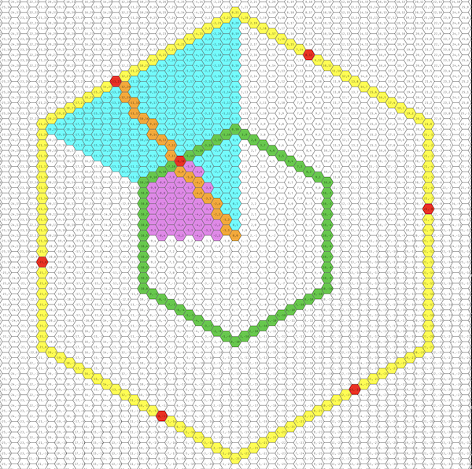
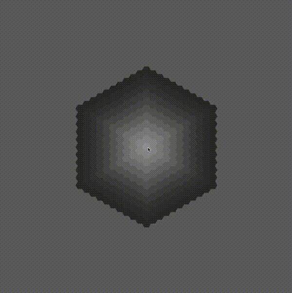
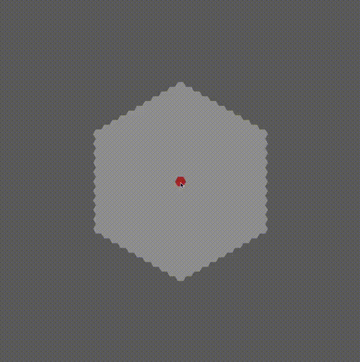
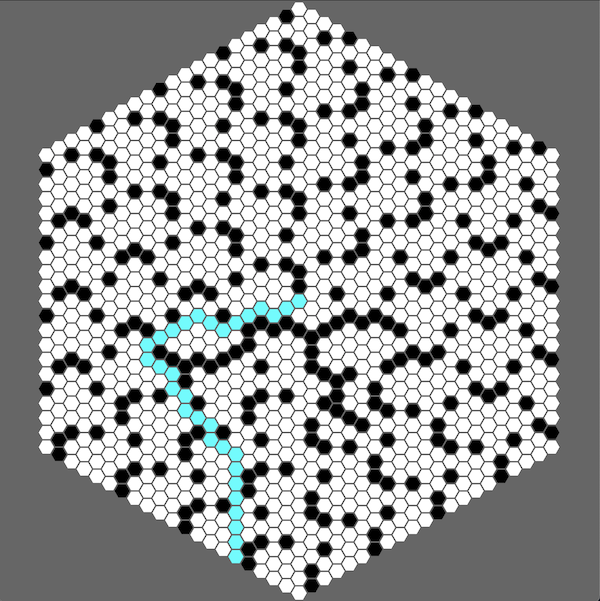
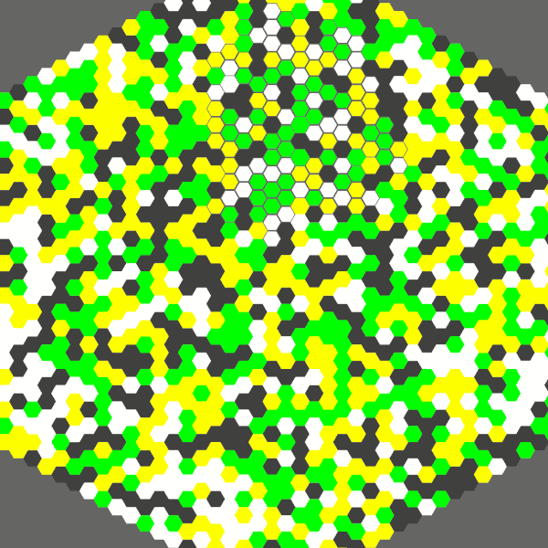
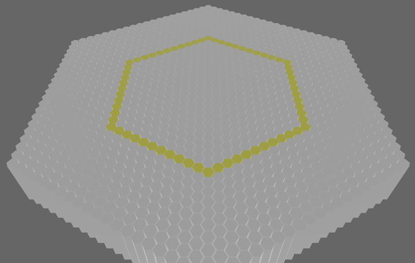
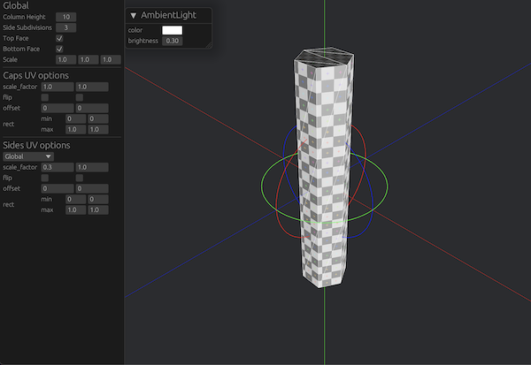
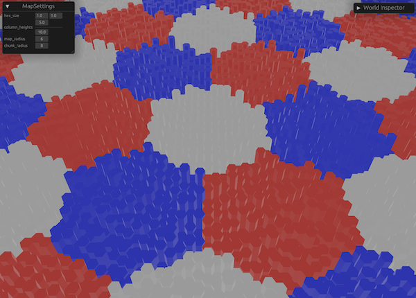

<p align="center">
  
</p>

[](https://github.com/ManevilleF/hexx/actions/workflows/rust.yml)
[](./LICENSE)
[](https://github.com/rust-secure-code/safety-dance/)
[](https://crates.io/crates/hexx)
[](https://docs.rs/hexx)
[](https://deps.rs/crate/hexx)

<!-- cargo-sync-readme start -->

 Hexagonal tools lib in rust.

 > Inspired by this [`RedBlobGames` article](https://www.redblobgames.com/grids/hexagons/implementation.html)
 > and [Sander Evers](https://sanderevers.github.io/) work

 This lib allows you to:

 - Manipulate hexagon coordinates
 - Generate hexagonal maps with custom layouts and orientation
 - Generate hexagon meshes (planes or columns)

 I made the choice to use *Axial Coordinates* for performance and utility reasons,
 but the [`Hex`] type has conversion utilities with *cubic*, *doubled* and *offset* coordinates.

 > See the [hexagonal coordinate systems](https://www.redblobgames.com/grids/hexagons/#coordinates)

 ## Installation

 Run `cargo add hexx` in your project or add the following line to your `Cargo.toml`:

 - `hexx = "0.9"`

 ### Cargo features

 `hexx` supports serialization and deserialization of most types using [serde](https://github.com/serde-rs/serde),
 through the `serde` feature gate. To enable it add the following line to your `Cargo.toml`:

 - `hexx = { version = "0.9", features = ["serde"] }`

 By default `Hex` uses rust classic memory layout, if you want to use `hexx` through the FFI or
 have `Hex` be stored without any memory padding, the `packed` feature will make `Hex`
 `repr(C)`. To enable this behaviour add the following line to your `Cargo.toml`:

 - `hexx = { version = "0.9", features = ["packed"] }`

 `hexx` supports [Bevy Reflection](https://docs.rs/bevy_reflect/latest/bevy_reflect) through the
 `bevy_reflect` feature. To enable it add the following line to your `Cargo.toml`:

 - `hexx = { version = "0.9", features = ["bevy_reflect"] }`

 ## Features

 `hexx` provides the [`Hex`] coordinates with:

 - Distances
 - Neighbors and directions
 - Lines
 - Ranges
 - Rings
 - Edges
 - Wedges
 - Spirals
 - Rotation
 - Symmetry
 - Vector operations
 - Conversions to other coordinate systems:
     - Cubic coordinates
     - Offset coordinates
     - Doubled coordinates
     - Hexmod coordinates
 - Multiple hex resolution

 ## Basic usage

```rust
 use hexx::*;

 // Declare points in hexagonal spaces
 let point_a = hex(10, -5); // Equivalent of `Hex::new(10, -5)`
 let point_b = hex(-8, 15);
 // Find distance between them
 let dist = point_a.unsigned_distance_to(point_b);
 // Compute a line between points
 let line: Vec<Hex> = point_a.line_to(point_b).collect();
 // Compute a ring from `point_a` containing `point_b`
 let ring: Vec<Hex> = point_a.ring(dist).collect();
 // Rotate `point_b` around `point_a` by 2 times 60 degrees clockwise
 let rotated = point_b.rotate_cw_around(point_a, 2);
 // Find the direction between the two points
 let dir_a = point_a.main_direction_to(point_b);
 let dir_b = point_b.main_direction_to(point_a);
 assert!(dir_a == -dir_b);
 // Compute a wedge from `point_a` to `point_b`
 let wedge = point_a.wedge_to(point_b);
 // Get the average value of the wedge
 let avg = wedge.average();
```

 ## Layout usage

 [`HexLayout`] is the bridge between your world/screen/pixel coordinate system and the hexagonal
 coordinates system.

```rust
 use hexx::*;

 // Define your layout
 let layout = HexLayout {
    hex_size: Vec2::new(1.0, 1.0),
    orientation: HexOrientation::Flat,
    ..Default::default()
 };
 // Get the hex coordinate at the world position `world_pos`.
 let world_pos = Vec2::new(53.52, 189.28);
 let point = layout.world_pos_to_hex(world_pos);
 // Get the world position of `point`
 let point = hex(123, 45);
 let world_pos = layout.hex_to_world_pos(point);
```

 ## Wrapping

 [`HexBounds`] defines a bounding hexagon around a center coordinate.
 It can be used for boundary and interesection checks but also for wrapping
 coordinates.
 Coordinate wrapping transform a point outside of the bounds to a point inside.
 This allows for seamless or repeating [wraparound](https://www.redblobgames.com/grids/hexagons/#wraparound) maps.

 ```rust
 use hexx::*;

 let center = hex(23, -45);
 let radius = 5;
 let bounds = HexBounds::new(center, radius);
 let outside_coord = hex(12345, 98765);
 assert!(!bounds.is_in_bounds(outside_coord));
 let wrapped_coord = bounds.wrap(outside_coord);
 assert!(bounds.is_in_bounds(wrapped_coord));
 ```

 ## Resolutions and chunks

 [`Hex`] support multi-resolution coordinates.
 In practice this means that you may convert a coordinate to a different resolution:
 - To a lower resolution, meaning retrieving a *parent* coordinate
 - to a higher resolution, meaning retrieving the center *child* coordinate

 Resolutions are abstract, the only useful information is the resolution **radius**.

 For example, if you use a big grid, with a radius of a 100, you might want to
 split that grid evenly in larger hexagons containing a 10 radius of coordinates
 and maybe do operations locally inside of these chunks.

 So instead of using a big range directly:

 ```rust
 use hexx::*;

 const MAP_RADIUS: u32 = 100;

 // Our big grid with hundreds of hexagons
 let big_grid = Hex::ZERO.range(MAP_RADIUS);
 ```

 You may define a smaller grid you will then divide to a higher resolution

 ```rust
 use hexx::*;

 const CHUNK_RADIUS: u32 = 10;
 const MAP_RADIUS: u32 = 20;

 let chunks = Hex::ZERO.range(MAP_RADIUS);
 for chunk in chunks {
     // We can retrieve the center of that chunk by increasing the resolution
     let center = chunk.to_higher_res(CHUNK_RADIUS);
     // And retrieve the other coordinates in the chunk
     let children = center.range(CHUNK_RADIUS);
     // We can retrieve the chunk coordinates from any coordinate..
     for coord in children {
         // .. by reducing the resolution
         assert_eq!(coord.to_lower_res(CHUNK_RADIUS), chunk);
     }
 }
 ```

 An other usage could be to draw an infinite hex grid, with different resolutions
 displayed, dynamically changing according to user zoom level.

 ## Usage in [Bevy](https://bevyengine.org/)

 If you want to generate 3D hexagonal mesh and use it in [bevy](bevyengine.org) you may do it this way:

```rust
 use bevy::prelude::Mesh;
 use bevy::render::{mesh::Indices, render_resource::PrimitiveTopology};
 use hexx::MeshInfo;

 pub fn hexagonal_plane(mesh_info: MeshInfo) -> Mesh {
    let mut mesh = Mesh::new(PrimitiveTopology::TriangleList);
    mesh.insert_attribute(Mesh::ATTRIBUTE_POSITION, mesh_info.vertices);
    mesh.insert_attribute(Mesh::ATTRIBUTE_NORMAL, mesh_info.normals);
    mesh.insert_attribute(Mesh::ATTRIBUTE_UV_0, mesh_info.uvs);
    mesh.set_indices(Some(Indices::U16(mesh_info.indices)));
    mesh
 }
```

 The [`MeshInfo`] can be produced from [`PlaneMeshBuilder`] or [`ColumnMeshBuilder`]

<!-- cargo-sync-readme end -->

> See the [examples](examples) for bevy usage

## Examples

`hexx` provides interactive examples showcasing various features:

### Hex grid



 > `cargo run --example hex_grid`

This example showcases hex ranges, rings, wedges, rotation, and lines

### Scroll Map



 > `cargo run --example scroll_map`

 This example showcases the `HexMap` struct for scrolling maps

### Wrap Map



 > `cargo run --example wrap_map`

 This example showcases the `HexMap` struct for looping/wrapping map

### A Star pathfinding



 > `cargo run --example a_star`

 This example showcases the A star algorithm, with an interactive pathfinding
 between the origin and your cursor. Clicking on tile toggles their availability

### Field of view


 > `cargo run --example fov`

 This example showcases the FOV algorithm, with an interactive range fov around
 your cursor.
 Clicking on tile toggles their visibility.

### Field of movement



 > `cargo run --example field_of_view`

 This example showcases the field of movement algorithm, interactively displaying
 the accessible range of movement around the cursor.

### 3d columns



 > `cargo run --example 3d_columns`

 This example showcases the 3d hexagon columns procedural generation

### Mesh builder



 > `cargo run --example mesh_builder --features bevy_reflect`

 This example showcases the hexagon columns procedural generation customization options

### Chunks


 > `cargo run --example chunks`

 This example showcases the hexagon resolution system, allowing to tile coordinates
 in evenly sized chunks

### Merged Chunks



 > `cargo run --example merged_columns --features bevy_reflect`

 This example showcases how to build a simple hex chunk system with each chunk
 being a single mesh
